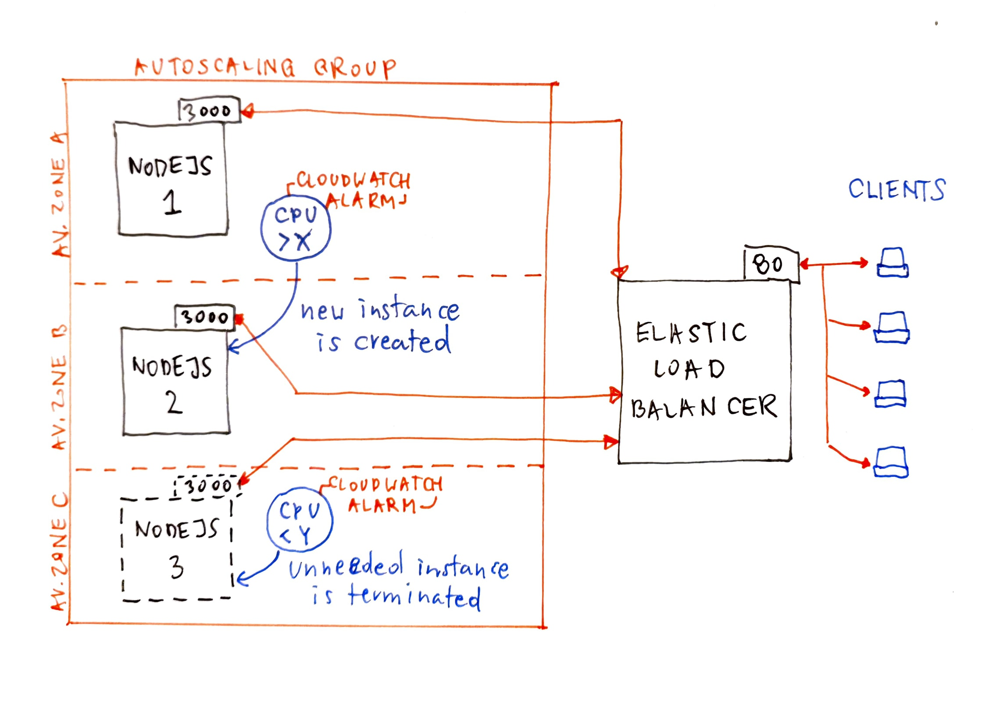

# NodeJS High Availability
Example HA infrastructure for simple NodeJS applications implemented in Terraform.

## Prerequisites
1. Terraform >= 1.0.
2. AWS account with `AmazonEC2FullAccess` and `AutoScalingFullAccess` permissions.
3. Access key with ID and secret for the above account.
4. SSH public key in [AWS-compatible format](https://docs.aws.amazon.com/AWSEC2/latest/UserGuide/ec2-key-pairs.html#how-to-generate-your-own-key-and-import-it-to-aws).
5. Public IP (or IPs) for SSH connections.
6. [ApacheBench tool](https://httpd.apache.org/docs/2.4/programs/ab.html).

## How to run
1. Configure `aws_access_key_id`, `aws_secret_access_key`, `ssh_ips` and `ssh_pubkey` in `terraform.tfvars` file.
2. Optionally tweak the defaults in `variables.tf` file.
3. Run `terraform init`.
4. Run `terraform apply -auto-approve`.
5. The benchmark is run as the last step, first time it will likely fail as the infrastructure is not yet in place. Subsequent applies will trigger it again.

## Architecture overview
